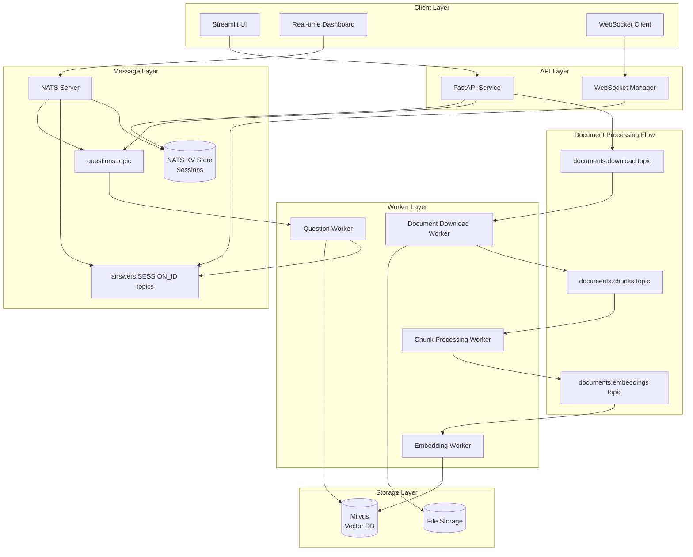
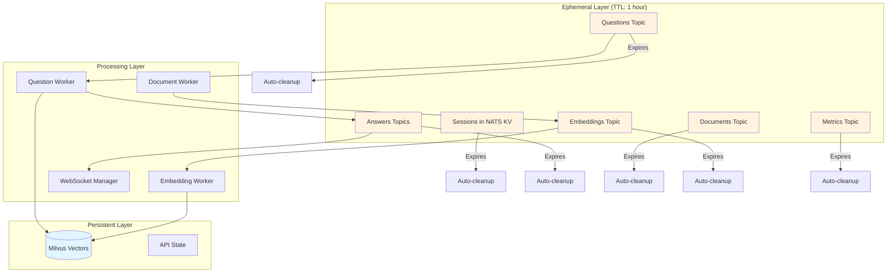

# RAG 101 Project - Product Requirements Document

This project is intended to be a starting point for people creating a RAG (**R**etrieval **A**ugmented **G**eneration) system. Its main goal is to create a system to answer questions about illnesses based on documents from [Protocolos Clínicos e Diretrizes Terapêuticas - PCDT](https://www.gov.br/saude/pt-br/assuntos/pcdt).

The idea is to start with a clear vector database and allow adding PDF documents from URLs of PCDT. As these documents are added to the knowledge base, users can use the provided chat to ask questions that the software will answer.

Main components of this software are:
* **Vector Database**: we use [Milvus](https://milvus.io/) open source as a vector database.
* **Message Queue/Stream/Key Value DB**: to serve as a queue provider, a Stream infrastructure and a Key Value in-memory database we use [NATS](https://docs.nats.io/) software
* **Workers**: software written in python to execute background tasks such as: download files, extract chunks, create embeddings, compose answers, etc.
* **API**: a FastAPI software to allow the UI component to interact with backend infrastructure
* **UI**: a [Streamlit](https://streamlit.io/) software for users to interact with the platform. Its main functionalities are:
    * Allows users to ask questions to the system and get answers from it
    * Allows users to send a URL to be indexed in the RAG system
    * **Real-time System Dashboard**: Visual monitoring of message flows through NATS topics with live status indicators
    * See some statistics from the system

**System Architecture**


**Message Flow:**

**Q&A Workflow:**
1. **Session Creation**: UI → API → NATS KV Store (session_id, nickname, TTL)
2. **Question Submission**: UI → API → NATS `questions` topic (session_id, question)
3. **Question Processing**: Question Worker consumes from `questions` → RAG pipeline → Milvus lookup
4. **Answer Generation**: Question Worker → LangChain + Gemini → NATS `answers.{session_id}` topic
5. **Real-time Delivery**: NATS `answers.{session_id}` → WebSocket → Client (filtered by session)

**Document Indexing Workflow:**
1. **Document Submission**: Admin/UI → API → Individual messages to NATS `documents.download` topic
2. **PDF Download & Text Extraction**: Document Download Worker → Download PDF → LangChain loaders → Raw text extraction → NATS `documents.chunks` topic
3. **Text Chunking**: Chunk Processing Worker → Read from `documents.chunks` → Text splitting with metadata → NATS `documents.embeddings` topic (parallel)
4. **Embedding Generation**: Embedding Worker → Read from `documents.embeddings` → GoogleGenerativeAI → Vector embeddings
5. **Knowledge Base Update**: Embedding Worker → Store in Milvus → Available for Q&A queries

**Integration**: New documents automatically enhance the knowledge base for all future Q&A sessions

## Real-time System Dashboard

The UI includes a visual monitoring dashboard that provides real-time visibility into the system's message processing flows:

### Dashboard Features:
- **Live Topic Visualization**: Graphical representation of NATS topics as interactive boxes
- **Status Indicators**: 
  - **Grey boxes**: Topics with no pending messages (idle state)
  - **Green boxes**: Topics actively processing messages
- **Message Flow Tracking**: Real-time updates showing message movement through the pipeline
- **Dual Flow Monitoring**: 
  - **Q&A Flow**: `questions` → `answers.{session_id}` topic progression
  - **Document Indexing Flow**: `documents.download` → `documents.chunks` → `documents.embeddings` topic progression

### Technical Implementation:
- WebSocket connection to NATS for real-time topic statistics
- Streamlit components with auto-refresh capabilities  
- NATS JetStream consumer info API for message counts and processing status
- Visual updates triggered by topic message count changes

### Demo Benefits:
- Provides immediate visual feedback during presentations
- Shows system activity and responsiveness in real-time
- Demonstrates the distributed processing architecture
- Helps audience understand message flow and system behavior

## Technologies

This project leverages the following core technologies:

### Core Stack
- **Python 3.12+**: Primary programming language for all services
- **Poetry**: Dependency management and virtual environment handling for development
- **Docker & Docker Compose**: Containerization and orchestration for deployment

### Data & Messaging Infrastructure  
- **Milvus**: Open-source vector database for embeddings storage and similarity search
- **NATS**: Message broker providing queuing, streaming, and key-value storage capabilities
- **MinIO**: S3-compatible object storage (used by Milvus)
- **etcd**: Distributed key-value store (used by Milvus for metadata)

### Application Framework
- **FastAPI**: Modern Python web framework for building the REST API
- **Streamlit**: Interactive web application framework for the user interface
- **LangChain**: LLM orchestration framework for RAG pipeline management
- **PyMilvus**: Official Python SDK for Milvus interactions
- **NATS.py**: Official Python client for NATS messaging

### AI/ML Stack
- **Google Gemini**: LLM provider for embeddings and text generation
  - **text-embedding-004**: High-quality text embeddings for semantic search
  - **gemini-pro**: Advanced language model for answer generation
- **LangChain Integrations**:
  - **GoogleGenerativeAIEmbeddings**: Gemini embedding integration
  - **ChatGoogleGenerativeAI**: Gemini chat model integration
  - **Milvus Vector Store**: LangChain connector for Milvus
  - **Document Loaders**: PDF processing and text extraction
  - **Text Splitters**: Intelligent document chunking strategies

### Development vs Production
- **Development**: Poetry manages dependencies, virtual environments, and local execution
- **Production**: Docker containers built from Poetry-managed projects, orchestrated via Docker Compose

## Getting Started

### Prerequisites
- **Python 3.11+**: Required for all services
- **Poetry**: Install via `curl -sSL https://install.python-poetry.org | python3 -`
- **Docker & Docker Compose**: Required for running the infrastructure stack

### Quick Setup

1. **Clone and Setup Infrastructure**
   ```bash
   git clone https://github.com/darthapple/rag-101.git
   cd rag-101
   
   # Start infrastructure services (Milvus, NATS, etc.)
   docker-compose up -d
   ```

2. **Development Setup (Choose One Service)**
   ```bash
   # Example: Setting up the worker service
   cd services/worker
   poetry install
   poetry shell
   
   # Configure environment variables
   export MILVUS_HOST=localhost
   export MILVUS_PORT=19530
   export NATS_URL=nats://localhost:4222
   
   # Run the service
   poetry run python main.py
   ```

3. **Full Production Deployment**
   ```bash
   # Build and run all services
   docker-compose -f docker-compose.yml -f docker-compose.services.yml up --build
   ```

### Development Workflow Options

**Option 1: Mixed Development**
- Run infrastructure with Docker Compose (`docker-compose up -d`)
- Run services locally with Poetry for faster development cycles

**Option 2: Full Docker**
- Run everything in containers for production-like environment
- Slower development cycle but matches production exactly

**Option 3: Service-by-Service**
- Run only the infrastructure and services you're not working on in Docker
- Run your target service locally with Poetry

### Environment Configuration
See the [Configuration Reference](#configuration-reference) section for complete environment variable documentation.

## Configuration Reference

Complete environment variable documentation for all services in the ephemeral/vector architecture:

### Core Infrastructure Settings

**NATS Configuration (Ephemeral Messaging)**
```bash
# Connection
NATS_URL=nats://localhost:4222                    # NATS server URL
NATS_USER=                                        # Optional: NATS username
NATS_PASSWORD=                                    # Optional: NATS password
NATS_TOKEN=                                       # Optional: Authentication token

# JetStream & TTL Settings  
NATS_JETSTREAM_DOMAIN=                           # Optional: JetStream domain
SESSION_TTL=3600                                 # Session expiration (seconds) - Default: 1 hour
MESSAGE_TTL=3600                                 # Message expiration (seconds) - Default: 1 hour
KV_TTL=3600                                      # Key-Value store TTL (seconds) - Default: 1 hour

# Topic Configuration
QUESTIONS_TOPIC=questions                        # Questions topic name
DOCUMENTS_TOPIC=documents.download               # Document processing topic
CHUNKS_TOPIC=documents.chunks                   # Text chunking topic
EMBEDDINGS_TOPIC=documents.embeddings           # Embedding generation topic
ANSWERS_TOPIC_PREFIX=answers                     # Prefix for answer topics (answers.{session_id})
METRICS_TOPIC=system.metrics                     # System monitoring topic
ERRORS_TOPIC_PREFIX=errors                       # Error logging topic prefix

# Consumer Settings
MAX_CONSUMER_RETRIES=3                          # Max message processing retries
CONSUMER_ACK_WAIT=30                            # Seconds to wait for message ACK
CONSUMER_MAX_DELIVER=3                          # Max delivery attempts per message
```

**Milvus Configuration (Vector-only Storage)**
```bash
# Connection
MILVUS_HOST=localhost                           # Milvus server host
MILVUS_PORT=19530                              # Milvus server port  
MILVUS_USER=                                   # Optional: Milvus username
MILVUS_PASSWORD=                               # Optional: Milvus password

# Collection Settings
MILVUS_COLLECTION=medical_documents            # Collection name for vectors
VECTOR_DIMENSION=768                           # Embedding dimension (text-embedding-004)
INDEX_TYPE=IVF_FLAT                           # Vector index type (IVF_FLAT, HNSW, IVFSQ8)
METRIC_TYPE=COSINE                            # Similarity metric (COSINE, L2, IP)
INDEX_NLIST=128                               # IVF_FLAT parameter: number of clusters

# Search Parameters
SEARCH_NPROBE=10                              # Search parameter for IVF_FLAT
SEARCH_TOP_K=5                                # Default top-K results for RAG
SEARCH_TIMEOUT=10                             # Search timeout in seconds
```

### AI/ML Service Settings

**Google Gemini API Configuration**
```bash
# Authentication
GOOGLE_API_KEY=your_api_key_here               # Required: Gemini API key

# Model Selection
EMBEDDING_MODEL=text-embedding-004             # Gemini embedding model
CHAT_MODEL=gemini-pro                         # Gemini text generation model
GENERATION_MODEL=gemini-pro                   # Alternative name for chat model

# Generation Parameters
MAX_TOKENS=2048                               # Max tokens in generated response
TEMPERATURE=0.7                               # Generation creativity (0.0-1.0)
TOP_P=0.9                                     # Nucleus sampling parameter
TOP_K=40                                      # Top-K sampling parameter

# Rate Limiting & Retries
GEMINI_RATE_LIMIT=60                          # Requests per minute
GEMINI_MAX_RETRIES=3                          # Max retry attempts for failed requests
GEMINI_RETRY_DELAY=1                          # Seconds between retry attempts
```

**LangChain Configuration**
```bash
# Debugging & Tracing
LANGCHAIN_TRACING_V2=true                     # Enable LangChain tracing
LANGCHAIN_API_KEY=your_langsmith_key          # Optional: LangSmith API key
LANGCHAIN_PROJECT=rag-101-demo                # LangSmith project name

# Document Processing
CHUNK_SIZE=1000                               # Text chunk size for splitting
CHUNK_OVERLAP=200                             # Overlap between chunks
TEXT_SPLITTER=recursive                       # Splitter type (recursive, character, token)
MAX_DOCUMENT_SIZE=10485760                    # Max PDF size (10MB)

# RAG Chain Configuration
RAG_CHAIN_TYPE=stuff                          # LangChain RAG type (stuff, map_reduce, refine)
CONTEXT_WINDOW_SIZE=4000                      # Context window for LLM
SIMILARITY_THRESHOLD=0.7                      # Minimum similarity score for retrieval
```

### Service-Specific Settings

**Worker Service Configuration**
```bash
# Concurrency Controls (for resource-limited environments)
MAX_DOCUMENT_WORKERS=2                        # Max concurrent document processors
MAX_EMBEDDING_WORKERS=2                       # Max concurrent embedding generators  
MAX_QUESTION_WORKERS=2                        # Max concurrent question processors

# Processing Timeouts
DOCUMENT_DOWNLOAD_TIMEOUT=60                  # PDF download timeout (seconds)
EMBEDDING_GENERATION_TIMEOUT=30               # Embedding creation timeout (seconds)
QUESTION_PROCESSING_TIMEOUT=45                # Q&A processing timeout (seconds)

# Batch Processing
EMBEDDING_BATCH_SIZE=10                       # Embeddings processed per batch
VECTOR_INSERT_BATCH_SIZE=100                  # Vector insertions per batch

# Health Check
HEALTH_CHECK_PORT=8000                        # Worker health check port
HEALTH_CHECK_PATH=/health                     # Health check endpoint path
```

**API Service Configuration**
```bash
# FastAPI Settings
API_HOST=0.0.0.0                             # API server bind address
API_PORT=8000                                # API server port
API_WORKERS=1                                # Uvicorn worker processes (demo: 1)
API_RELOAD=false                             # Auto-reload on code changes

# Session Management  
SESSION_KV_BUCKET=sessions                   # NATS KV bucket for sessions
MAX_SESSIONS=1000                           # Maximum concurrent sessions
SESSION_CLEANUP_INTERVAL=300                # Session cleanup interval (seconds)

# WebSocket Configuration
WEBSOCKET_HEARTBEAT_INTERVAL=30             # WebSocket ping interval (seconds)
MAX_WEBSOCKET_CONNECTIONS=1000              # Max WebSocket connections
WEBSOCKET_TIMEOUT=300                       # WebSocket idle timeout (seconds)
MAX_CONNECTIONS_PER_SESSION=5               # Max WebSockets per session

# Rate Limiting
RATE_LIMIT_QUESTIONS=10                     # Questions per session per minute
RATE_LIMIT_DOCUMENTS=100                    # Document URLs per hour globally
RATE_LIMIT_WINDOW=60                        # Rate limit window (seconds)
```

**UI Service Configuration**  
```bash
# Streamlit Settings
UI_HOST=0.0.0.0                             # UI server bind address
UI_PORT=8501                                # UI server port
UI_THEME=light                              # UI theme (light, dark)

# External Service URLs
API_BASE_URL=http://localhost:8000/api/v1   # FastAPI service URL
NATS_URL=nats://localhost:4222              # NATS for dashboard monitoring

# Dashboard Settings
DASHBOARD_REFRESH_INTERVAL=1000             # Dashboard update interval (milliseconds)
DASHBOARD_MAX_POINTS=100                    # Max data points on charts
DASHBOARD_AUTO_REFRESH=true                 # Enable auto-refresh

# Chat Interface
MAX_CHAT_HISTORY=50                         # Max messages in chat history
CHAT_TIMEOUT=30                             # Chat response timeout (seconds)
ENABLE_FILE_UPLOAD=true                     # Enable PDF URL submission
```

### Development vs Production

- **Development**: Debug logging, hot reloading, reduced TTLs (5 min) for faster testing
- **Production**: Info logging, stable deployment, standard TTLs (1 hour), multiple API workers

### Required vs Optional Variables

**Required (System won't start without these):**
- `GOOGLE_API_KEY`: Gemini API authentication
- `NATS_URL`: Message broker connection
- `MILVUS_HOST`, `MILVUS_PORT`: Vector database connection

**Optional (Have sensible defaults):**
- All TTL settings (default: 3600 seconds)
- Worker concurrency settings (default: 2 each)
- Rate limiting settings (defaults provided)
- UI/UX settings (defaults provided)

## Error Handling Strategy

For this demo version, error handling is kept minimal to focus on core functionality and rapid development:

### Current Approach:
- **Basic Exception Handling**: Services will log errors but continue processing other messages
- **No Retry Logic**: Failed operations (PDF downloads, embedding generation) are logged but not retried
- **Graceful Degradation**: Individual document processing failures don't affect other documents or Q&A functionality

### Future Improvements (Post-Demo):
- **Comprehensive Retry Logic**: Exponential backoff for API calls and network operations
- **Dead Letter Queues**: Failed messages routed to dedicated topics for manual inspection
- **Circuit Breakers**: Protection against cascading failures in external API calls
- **Health Checks**: Monitoring endpoints for all services with dependency status
- **Alerting System**: Real-time notifications for critical failures
- **Data Validation**: Input sanitization and schema validation for all message types

### Demo Considerations:
- Focus on happy path scenarios during presentation
- Have backup documents ready in case of processing failures
- Monitor logs for any issues during demo
- Keep infrastructure simple to minimize failure points

## Architecture Deep-dive

Detailed explanation of system flows, design decisions, and ephemeral data patterns:

### Technology Choice Rationale

**Why Milvus (Vector-Only Storage)?**
- **Purpose-Built**: Optimized specifically for vector similarity search
- **Scalability**: Handles millions of vectors with sub-100ms search times
- **Metadata Support**: Can store associated metadata alongside vectors
- **No Overhead**: No relational database complexity for simple vector operations
- **LangChain Integration**: Native support in LangChain ecosystem

**Why NATS (Ephemeral Messaging)?**
- **JetStream Support**: Provides durability during processing while maintaining TTL expiration
- **Subject-Based Routing**: Natural fit for session-based answer routing (`answers.{session_id}`)
- **Key-Value Store**: Built-in ephemeral key-value for session management
- **Lightweight**: Minimal resource overhead compared to Kafka/RabbitMQ
- **Real-time**: Excellent WebSocket integration for live updates

**Why Google Gemini?**
- **Unified API**: Single provider for both embeddings and text generation
- **Quality**: High-quality embeddings (768-dimension) and generation models
- **Cost-Effective**: Competitive pricing for demo/development usage
- **LangChain Native**: First-class support in LangChain ecosystem

### System Workflows

The system implements two main workflows:

1. **Document Processing**: URLs → Download → Chunking → Embedding → Vector Storage
2. **Question & Answer**: Session Creation → Question Processing → RAG Pipeline → Real-time Answer Delivery

### Data Flow Architecture

**Ephemeral Data Lifecycle:**


### Message Flow Patterns

**1. Fan-out Pattern (Document Processing):**
```
Single PDF URL → Multiple chunk messages
                ↓
        Parallel embedding generation
                ↓
        Batch insert to Milvus
```

**2. Session-based Routing Pattern (Q&A):**
```
Question → Worker Processing → answers.{specific_session_id}
                                      ↓
                            Only that session receives answer
```

**3. Real-time Dashboard Pattern:**
```
All Topics → Metrics Aggregation → system.metrics topic
                                        ↓
                                Dashboard updates
```

### Performance Characteristics

**Latency Expectations:**
- **Question → Answer**: 2-5 seconds (including LLM generation)
- **Vector Search**: < 100ms for top-5 results
- **WebSocket Delivery**: < 50ms after answer generation
- **Document Processing**: 30-60 seconds per PDF (depending on size)

**Throughput Expectations:**
- **Concurrent Questions**: 10-20 per minute (limited by Gemini API)
- **Document Processing**: 2-5 documents concurrently
- **Vector Search**: 1000+ searches per second (Milvus capability)

**Resource Usage (Notebook Constraints):**
- **Memory**: ~4GB total (2GB Milvus, 1GB workers, 1GB infrastructure)
- **CPU**: Burst usage during embedding generation
- **Storage**: Minimal (only vectors persist, ~1KB per chunk)
- **Network**: Primarily Gemini API calls

### Error Handling Patterns

**Circuit Breaker Pattern:**
```
API Call → Success? → Continue
           ↓ No
    Rate Limit? → Wait & Retry
           ↓ No  
    Hard Failure → Log & Skip (Demo simplicity)
```

**Graceful Degradation:**
```
Service Down → Continue processing other messages
Missing Data → Skip with warning log
API Timeout → Log error, no retry (demo simplicity)
```

### Scalability Considerations

**Current Limitations (Demo-focused):**
- Single-instance Streamlit UI
- Limited worker concurrency (resource constraints)
- No load balancing between API instances
- Simplified error handling

**Future Scaling Options:**
- **Horizontal Workers**: NATS naturally supports multiple consumer instances
- **API Load Balancing**: FastAPI can run multiple instances behind nginx
- **Milvus Clustering**: Supports distributed deployment
- **NATS Clustering**: Supports multi-node deployments

### Development vs Production Patterns

**Development (Local):**
- Mixed deployment (Docker infrastructure + local services)
- Hot reloading enabled
- Debug logging
- Short TTLs for faster iteration

**Demo/Production:**
- Full Docker deployment
- Resource limits configured
- Production logging levels
- Standard 1-hour TTLs

### Security Architecture (Demo-appropriate)

**Current Approach:**
- Environment variable API keys
- Local network binding
- No authentication (simplified for demo)
- Ephemeral data (auto-expiring sensitive information)

**Production Considerations:**
- API authentication/authorization
- TLS/SSL encryption
- Network segmentation
- Audit logging
- Secret management systems

This architecture prioritizes demo effectiveness and development simplicity while maintaining the core RAG functionality and real-time user experience.

## Testing Strategy

Testing approach designed for the ephemeral/vector architecture and demo requirements:

### Testing Architecture Principles
- **Stateless Testing**: No persistent state between tests
- **Ephemeral Data**: All test data expires automatically via TTL
- **Vector Similarity Testing**: Approximate matching for embeddings
- **Message Flow Testing**: Asynchronous processing validation

### Unit Testing

**Vector Database Tests (`test_vector_operations.py`)**
```python
import pytest
from pymilvus import Collection
import numpy as np

def test_milvus_collection_schema():
    """Test Milvus collection structure matches specification"""
    collection = Collection("medical_documents_test")
    schema = collection.schema
    
    # Verify required fields exist
    field_names = [field.name for field in schema.fields]
    expected_fields = ["chunk_id", "embedding", "text_content", "document_title", 
                      "source_url", "page_number", "diseases", "processed_at", "job_id"]
    assert all(field in field_names for field in expected_fields)
    
    # Verify vector dimension
    embedding_field = next(f for f in schema.fields if f.name == "embedding")
    assert embedding_field.params["dim"] == 768

def test_vector_similarity_search():
    """Test vector search returns relevant results"""
    # Insert test vectors with known similarity
    test_embedding = np.random.random(768).tolist()
    similar_embedding = (np.array(test_embedding) + 0.1).tolist()
    
    # Search and verify results
    results = collection.search([test_embedding], "embedding", limit=5)
    assert len(results) > 0
    assert results[0].distance > 0.8  # High similarity expected
```

**Message Handling Tests (`test_nats_messages.py`)**
```python
import asyncio
import pytest
from nats.aio.client import Client as NATS

@pytest.mark.asyncio
async def test_ephemeral_message_expiry():
    """Test messages expire according to TTL"""
    nc = NATS()
    await nc.connect("nats://localhost:4222")
    
    # Publish message with short TTL
    await nc.publish("test.topic", b'{"test": "data"}', headers={"TTL": "5"})
    
    # Wait for expiry and verify message is gone
    await asyncio.sleep(6)
    # Verification logic here
    
    await nc.close()

@pytest.mark.asyncio  
async def test_session_based_routing():
    """Test answers route to correct session"""
    session_id = "test-session-123"
    
    # Subscribe to session-specific topic
    sub = await nc.subscribe(f"answers.{session_id}")
    
    # Publish answer to this session
    await nc.publish(f"answers.{session_id}", b'{"answer": "test response"}')
    
    # Verify only this session receives message
    msg = await sub.next_msg(timeout=5)
    assert msg.data == b'{"answer": "test response"}'
```

**LangChain Integration Tests (`test_rag_pipeline.py`)**
```python
def test_document_chunking():
    """Test PDF processing produces expected chunks"""
    from langchain.text_splitter import RecursiveCharacterTextSplitter
    
    splitter = RecursiveCharacterTextSplitter(
        chunk_size=1000,
        chunk_overlap=200
    )
    
    test_text = "Sample medical document text..." * 100
    chunks = splitter.split_text(test_text)
    
    assert all(len(chunk) <= 1200 for chunk in chunks)  # Allows for overlap
    assert len(chunks) > 1

def test_embedding_generation():
    """Test Gemini embeddings have correct dimensions"""
    from langchain_google_genai import GoogleGenerativeAIEmbeddings
    
    embeddings = GoogleGenerativeAIEmbeddings(model="text-embedding-004")
    result = embeddings.embed_query("test medical question")
    
    assert len(result) == 768
    assert all(isinstance(x, float) for x in result)
```

### Integration Testing

**End-to-End Workflow Tests (`test_e2e_flows.py`)**
```python
@pytest.mark.integration
async def test_document_processing_flow():
    """Test complete document indexing workflow"""
    # 1. Submit document URL
    response = await api_client.post("/document-download", 
                                   json={"urls": ["http://test.com/doc.pdf"]})
    assert response.status_code == 200
    job_ids = response.json()["job_ids"]
    
    # 2. Wait for processing (with timeout)
    await asyncio.sleep(30)
    
    # 3. Verify chunks in Milvus
    collection = Collection("medical_documents")
    results = collection.query(expr=f'job_id == "{job_ids[0]}"')
    assert len(results) > 0

@pytest.mark.integration 
async def test_question_answer_flow():
    """Test complete Q&A workflow with real embeddings"""
    # 1. Create session
    session_response = await api_client.post("/create-session", 
                                           json={"nickname": "test_user"})
    session_id = session_response.json()["session_id"]
    
    # 2. Submit question
    question_response = await api_client.post("/question",
                                            json={"session_id": session_id,
                                                 "question": "What is diabetes?"})
    assert question_response.status_code == 200
    
    # 3. Listen for answer via WebSocket
    async with websockets.connect(f"ws://localhost:8000/answer?session_id={session_id}") as ws:
        answer = await asyncio.wait_for(ws.recv(), timeout=30)
        answer_data = json.loads(answer)
        
        assert "answer" in answer_data
        assert "sources" in answer_data
        assert len(answer_data["sources"]) > 0
```

### Performance Testing

**Load Tests (`test_performance.py`)**
```python
import asyncio
import time

@pytest.mark.performance
async def test_concurrent_questions():
    """Test system handles multiple concurrent questions"""
    sessions = []
    
    # Create multiple sessions
    for i in range(10):
        response = await api_client.post("/create-session", 
                                       json={"nickname": f"user_{i}"})
        sessions.append(response.json()["session_id"])
    
    # Submit questions concurrently
    start_time = time.time()
    tasks = []
    for session_id in sessions:
        task = api_client.post("/question",
                             json={"session_id": session_id,
                                  "question": "What are diabetes symptoms?"})
        tasks.append(task)
    
    responses = await asyncio.gather(*tasks)
    elapsed = time.time() - start_time
    
    # Verify all succeeded within reasonable time
    assert all(r.status_code == 200 for r in responses)
    assert elapsed < 5.0  # All questions queued within 5 seconds

@pytest.mark.performance
def test_vector_search_latency():
    """Test Milvus search performance"""
    collection = Collection("medical_documents")
    test_vector = np.random.random(768).tolist()
    
    start_time = time.time()
    results = collection.search([test_vector], "embedding", limit=5)
    elapsed = time.time() - start_time
    
    assert elapsed < 0.1  # Sub-100ms search
    assert len(results) > 0
```

### Test Configuration

**pytest.ini**
```ini
[tool:pytest]
testpaths = tests
python_files = test_*.py
python_classes = Test*
python_functions = test_*
markers =
    unit: Unit tests (fast, isolated)
    integration: Integration tests (require infrastructure)
    performance: Performance/load tests
    slow: Tests that take > 5 seconds
asyncio_mode = auto
timeout = 300
```

**Fixture Setup (`conftest.py`)**
```python
import pytest
import asyncio
from httpx import AsyncClient
from services.api.main import app

@pytest.fixture(scope="session")
def event_loop():
    """Create event loop for async tests"""
    policy = asyncio.get_event_loop_policy()
    loop = policy.new_event_loop()
    yield loop
    loop.close()

@pytest.fixture
async def api_client():
    """HTTP client for API testing"""
    async with AsyncClient(app=app, base_url="http://test") as ac:
        yield ac

@pytest.fixture
async def milvus_test_collection():
    """Clean Milvus collection for testing"""
    from pymilvus import connections, Collection
    
    connections.connect("default", host="localhost", port="19530")
    collection_name = "medical_documents_test"
    
    # Create clean collection
    if Collection.exists(collection_name):
        Collection(collection_name).drop()
    
    # Setup test collection
    yield create_test_collection(collection_name)
    
    # Cleanup
    Collection(collection_name).drop()
```

### Testing Commands

```bash
poetry run pytest                    # All tests
poetry run pytest -m unit          # Unit tests only
poetry run pytest -m integration   # Integration tests
poetry run pytest --cov=services   # With coverage
```

### Demo-Specific Testing
- **Happy Path Focus**: Successful workflow testing
- **Infrastructure Dependencies**: Requires NATS, Milvus, and Gemini API
- **Ephemeral Data**: Automatic cleanup via TTL
- **Quick Feedback**: Unit tests < 1s, integration tests < 30s

## Developer Guide

This section provides technical details for developers working with the project:

### Milvus Vector Database
- Default port: 19530
- Schema requirements:
  - Collection must have a vector field (float32 array)
  - Recommended dimension: 768 (for text-embedding-004 model)
- Indexing options: IVF_FLAT, HNSW, or IVFSQ8 for production
- Use pymilvus directly or LangChain's Milvus vector store integration

### Google Gemini API Setup
See the [Technologies](#technologies) section for complete API setup and model configuration details.

### NATS Configuration
See [Configuration Reference](#configuration-reference) and [Message Schemas](#message-schemas) for complete NATS setup and message structure documentation.

### Worker Services
- **LangChain-powered RAG pipeline** with Gemini integration
- Four specialized worker types:
  - **Document Download Worker**: PDF downloading and raw text extraction
  - **Chunk Processing Worker**: Text chunking and metadata extraction using LangChain text splitters
  - **Embedding Worker**: Vector embedding generation
  - **Question Worker**: Real-time Q&A with RAG pipeline
- Multiprocessing architecture with configurable worker instances per topic
- Health check endpoint: `/health` (port 8000)
- See [Configuration Reference](#configuration-reference) for environment variables
- **Development**: `poetry run python main.py`
- **Production**: Dockerized with Poetry-managed dependencies 

### FastAPI Service
- Base URL: `/api/v1`
- **Session-Based Architecture** with real-time WebSocket capabilities
- **Session Management**: All endpoints require valid session_id (except health/docs)
- **Personalization**: Responses include user's nickname for personalized interaction
- OpenAPI docs available at `/docs`
- See [API Reference](#api-reference) for complete endpoint documentation
- **Development**: `poetry run uvicorn main:app --reload`
- **Production**: Dockerized FastAPI service

## API Reference

Complete documentation of all API endpoints for code generation and integration:

### Session Management

#### POST `/api/v1/create-session`
Creates a new user session with ephemeral storage in NATS KV.

**Request:**
```json
{
  "nickname": "string"
}
```

**Response (200):**
```json
{
  "session_id": "uuid-v4",
  "nickname": "string",
  "expires_at": "2024-01-01T13:00:00Z",
  "ttl_seconds": 3600
}
```

**Error Responses:**
```json
// 400 Bad Request
{
  "detail": "Nickname is required and must be between 1-50 characters"
}

// 500 Internal Server Error  
{
  "detail": "Failed to create session in NATS KV store"
}
```

### Question & Answer

#### POST `/api/v1/question`
Submits a question for RAG processing. All processing is ephemeral.

**Request:**
```json
{
  "session_id": "uuid-v4",
  "question": "string"
}
```

**Response (200):**
```json
{
  "status": "queued",
  "session_id": "uuid-v4",
  "message_id": "uuid-v4",
  "queued_at": "2024-01-01T12:30:00Z"
}
```

**Error Responses:**
```json
// 400 Bad Request
{
  "detail": "Question must be between 1-1000 characters"
}

// 404 Not Found
{
  "detail": "Session not found or expired"
}

// 429 Too Many Requests
{
  "detail": "Rate limit exceeded. Max 10 questions per session per minute"
}
```

#### WebSocket `/api/v1/answer?session_id={uuid}`
Real-time answer streaming from NATS ephemeral topics.

**Connection Parameters:**
- `session_id`: UUID-v4 format required
- Connection timeout: 300 seconds
- Heartbeat interval: 30 seconds

**Message Format (Incoming):**
```json
{
  "type": "answer",
  "data": {
    "answer": "string",
    "sources": [
      {
        "title": "string",
        "url": "string", 
        "page": "integer",
        "diseases": ["string", "string"]
      }
    ],
    "session_id": "uuid-v4",
    "nickname": "string",
    "generated_at": "2024-01-01T12:30:05Z"
  }
}
```

**Error Messages:**
```json
// Session not found
{
  "type": "error",
  "data": {
    "code": "SESSION_NOT_FOUND",
    "message": "Session expired or invalid"
  }
}

// Connection limit exceeded
{
  "type": "error", 
  "data": {
    "code": "CONNECTION_LIMIT",
    "message": "Maximum connections per session exceeded"
  }
}
```

### Document Management

#### POST `/api/v1/document-download`
Submits PDF URLs for ephemeral processing and vector storage.

**Request:**
```json
{
  "urls": [
    "https://example.com/document1.pdf",
    "https://example.com/document2.pdf"
  ]
}
```

**Response (200):**
```json
{
  "status": "queued",
  "document_count": 2,
  "job_ids": [
    "uuid-v4-job1",
    "uuid-v4-job2"  
  ],
  "queued_at": "2024-01-01T12:30:00Z",
  "expires_at": "2024-01-01T13:30:00Z"
}
```

**Error Responses:**
```json
// 400 Bad Request
{
  "detail": "Maximum 10 URLs per request. Each URL must be valid HTTP/HTTPS"
}

// 413 Payload Too Large
{
  "detail": "Request payload exceeds maximum size limit"
}
```

### System Information

#### GET `/api/v1/health`
Service health check with dependency status.

**Response (200):**
```json
{
  "status": "healthy",
  "timestamp": "2024-01-01T12:30:00Z",
  "dependencies": {
    "nats": {
      "status": "connected",
      "latency_ms": 2
    },
    "milvus": {
      "status": "connected", 
      "collections": 1,
      "total_entities": 15420
    }
  },
  "version": "1.0.0"
}
```

#### GET `/api/v1/docs`
Interactive API documentation (Swagger UI).

### Rate Limiting & Quotas
- **Questions**: 10 per session per minute
- **Document URLs**: 100 per hour globally
- **WebSocket Connections**: 5 per session
- **Session Duration**: 1 hour maximum (NATS TTL)

## Vector Database Schemas

Milvus serves as the sole persistent storage, containing only vector embeddings and associated metadata:

### Collection: `medical_documents`

**Purpose:** Stores document chunks as vector embeddings for semantic search in RAG pipeline.

**Schema Definition:**
```python
from pymilvus import Collection, FieldSchema, CollectionSchema, DataType

# Field definitions
fields = [
    FieldSchema(name="chunk_id", dtype=DataType.VARCHAR, max_length=36, is_primary=True),
    FieldSchema(name="embedding", dtype=DataType.FLOAT_VECTOR, dim=768),  # text-embedding-004 dimensions
    FieldSchema(name="text_content", dtype=DataType.VARCHAR, max_length=8192),
    FieldSchema(name="document_title", dtype=DataType.VARCHAR, max_length=512),
    FieldSchema(name="source_url", dtype=DataType.VARCHAR, max_length=1024), 
    FieldSchema(name="page_number", dtype=DataType.INT32),
    FieldSchema(name="diseases", dtype=DataType.VARCHAR, max_length=2048),  # JSON array as string
    FieldSchema(name="processed_at", dtype=DataType.VARCHAR, max_length=32),  # ISO timestamp
    FieldSchema(name="job_id", dtype=DataType.VARCHAR, max_length=36)
]

schema = CollectionSchema(fields, "Medical documents for RAG system")
collection = Collection("medical_documents", schema)
```

**Index Configuration:**
```python
# Vector similarity index for fast retrieval
index_params = {
    "metric_type": "COSINE",     # Cosine similarity for text embeddings
    "index_type": "IVF_FLAT",    # Good balance of speed/accuracy for demos
    "params": {"nlist": 128}     # Cluster parameter for IVF_FLAT
}

collection.create_index("embedding", index_params)
```

**Sample Data Structure:**
```json
{
  "chunk_id": "550e8400-e29b-41d4-a716-446655440000",
  "embedding": [0.1, -0.2, 0.3, ...],  // 768-dimensional vector
  "text_content": "A diabetes mellitus é uma doença crônica caracterizada...",
  "document_title": "Protocolo Clínico - Diabetes Mellitus Tipo 2", 
  "source_url": "https://www.gov.br/saude/pt-br/assuntos/pcdt/diabetes.pdf",
  "page_number": 15,
  "diseases": "[\"diabetes mellitus\", \"hiperglicemia\", \"resistência insulínica\"]",
  "processed_at": "2024-01-01T12:30:00Z",
  "job_id": "123e4567-e89b-12d3-a456-426614174000"
}
```

### Search Operations

**Semantic Search for RAG:**
```python
search_params = {
    "metric_type": "COSINE",
    "params": {"nprobe": 10}
}

# Query vector from user question embedding
results = collection.search(
    data=[question_embedding],           # 768-dim vector from text-embedding-004
    anns_field="embedding",             # Vector field to search
    param=search_params,
    limit=5,                           # Top-K results for RAG context
    output_fields=["text_content", "document_title", "source_url", "page_number", "diseases"]
)
```

**Collection Statistics:**
```python
# Useful for monitoring and dashboard
stats = collection.get_collection_stats()
print(f"Total entities: {stats.row_count}")
print(f"Index status: {collection.has_index()}")
```

### Vector Database Characteristics:
- **No Relational Data**: Pure vector storage with metadata
- **No Transactions**: Simple insert/search operations only
- **Ephemeral Processing**: All document processing happens in NATS, results stored here
- **Read-Heavy Workload**: Optimized for fast similarity search during Q&A
- **Scalable Storage**: Can handle large document collections without performance degradation

### Performance Expectations:
- **Search Latency**: < 100ms for top-5 similarity search
- **Throughput**: 1000+ concurrent searches per second
- **Storage**: ~1KB per chunk (768 floats + metadata)
- **Memory Usage**: Configurable index caching for production optimization

## Message Schemas

NATS handles all ephemeral messaging with 1-hour TTL. All data expires automatically:

### Session Management Messages

**NATS KV Store: `sessions`**
```json
{
  "key": "session:550e8400-e29b-41d4-a716-446655440000",
  "value": {
    "session_id": "550e8400-e29b-41d4-a716-446655440000",
    "nickname": "user_nickname",
    "created_at": "2024-01-01T12:00:00Z",
    "last_activity": "2024-01-01T12:30:00Z",
    "expires_at": "2024-01-01T13:00:00Z"
  },
  "ttl": 3600
}
```

### Question & Answer Flow

**Topic: `questions`**
```json
{
  "message_id": "123e4567-e89b-12d3-a456-426614174000",
  "session_id": "550e8400-e29b-41d4-a716-446655440000", 
  "nickname": "user_nickname",
  "question": "What are the symptoms of diabetes?",
  "submitted_at": "2024-01-01T12:30:00Z",
  "ttl": 3600
}
```

**Topic: `answers.{session_id}`**
```json
{
  "message_id": "456e7890-e12b-34c5-d678-901234567890",
  "session_id": "550e8400-e29b-41d4-a716-446655440000",
  "nickname": "user_nickname", 
  "question": "What are the symptoms of diabetes?",
  "answer": "According to the clinical protocols, diabetes symptoms include excessive thirst, frequent urination, and unexplained weight loss...",
  "sources": [
    {
      "title": "Protocolo Clínico - Diabetes Mellitus Tipo 2",
      "url": "https://www.gov.br/saude/pt-br/assuntos/pcdt/diabetes.pdf",
      "page": 12,
      "diseases": ["diabetes mellitus", "hiperglicemia"],
      "chunk_id": "789e0123-e45f-67g8-h901-234567890123"
    }
  ],
  "generated_at": "2024-01-01T12:30:05Z",
  "processing_time_ms": 1250,
  "ttl": 3600
}
```

### Document Processing Flow

**Topic: `documents.download`**
```json
{
  "job_id": "789e0123-e45f-67g8-h901-234567890123",
  "url": "https://www.gov.br/saude/pt-br/assuntos/pcdt/diabetes.pdf",
  "submitted_at": "2024-01-01T12:30:00Z",
  "metadata": {
    "priority": "normal",
    "requester": "api"
  },
  "ttl": 3600
}
```

**Topic: `documents.chunks`**
```json
{
  "job_id": "789e0123-e45f-67g8-h901-234567890123",
  "raw_text": "A diabetes mellitus é uma doença crônica caracterizada pela elevação da glicose no sangue (hiperglicemia). O diabetes pode ser classificado em diferentes tipos...",
  "document_metadata": {
    "source_url": "https://www.gov.br/saude/pt-br/assuntos/pcdt/diabetes.pdf",
    "title": "Protocolo Clínico - Diabetes Mellitus Tipo 2",
    "total_pages": 45,
    "file_size_bytes": 2048576,
    "content_hash": "sha256:abc123...",
    "downloaded_at": "2024-01-01T12:30:01Z"
  },
  "created_at": "2024-01-01T12:30:01Z",
  "ttl": 3600
}
```

**Topic: `documents.embeddings`**  
```json
{
  "chunk_id": "abc12345-def6-789g-hij0-123456789012",
  "job_id": "789e0123-e45f-67g8-h901-234567890123",
  "text": "A diabetes mellitus é uma doença crônica caracterizada pela elevação da glicose no sangue (hiperglicemia)...",
  "document_metadata": {
    "source_url": "https://www.gov.br/saude/pt-br/assuntos/pcdt/diabetes.pdf",
    "title": "Protocolo Clínico - Diabetes Mellitus Tipo 2",
    "page_number": 12, 
    "diseases": ["diabetes mellitus", "hiperglicemia", "resistência insulínica"],
    "processed_at": "2024-01-01T12:30:00Z",
    "content_hash": "sha256:abc123..."
  },
  "created_at": "2024-01-01T12:30:02Z",
  "ttl": 3600
}
```

### System Monitoring Messages

**Topic: `system.metrics`** (for dashboard)
```json
{
  "timestamp": "2024-01-01T12:30:00Z",
  "topic_stats": {
    "questions": {
      "pending_messages": 2,
      "consumers_active": 1,
      "messages_per_second": 0.5
    },
    "documents.embeddings": {
      "pending_messages": 15,
      "consumers_active": 2, 
      "messages_per_second": 3.2
    },
    "documents.download": {
      "pending_messages": 0,
      "consumers_active": 1,
      "messages_per_second": 0.1
    }
  },
  "ttl": 300
}
```

### Error Handling Messages

**Topic: `errors.{service_name}`** (ephemeral logging)
```json
{
  "error_id": "error-123e4567-e89b-12d3-a456-426614174000",
  "service": "document-worker",
  "timestamp": "2024-01-01T12:30:00Z",
  "error_type": "PDF_DOWNLOAD_FAILED",
  "message": "Failed to download PDF from URL",
  "context": {
    "job_id": "789e0123-e45f-67g8-h901-234567890123",
    "url": "https://broken-link.com/document.pdf",
    "retry_count": 0
  },
  "severity": "warning",
  "ttl": 3600
}
```

### Message Characteristics:
- **Ephemeral Nature**: All messages expire in 1 hour maximum
- **No Persistence**: System restart clears all processing state
- **TTL-Based Cleanup**: NATS automatically purges expired messages
- **JetStream Durability**: Messages persist only during processing window
- **Subject Filtering**: Real-time routing based on session_id and service patterns

### Message Flow Patterns:
1. **Fan-out**: Single document URL → multiple chunk messages
2. **Fan-in**: Multiple chunks → single vector database insert batch
3. **Request-Response**: Question → Answer (via different topics)
4. **Pub-Sub**: Dashboard subscribes to all topic statistics
5. **Session-based Routing**: Answers filtered by session_id

### Streamlit UI
- Interactive web interface with real-time dashboard
- See [Configuration Reference](#configuration-reference) for environment variables
- **Development**: `poetry run streamlit run main.py`
- **Production**: Dockerized service

## Development Workflow

The project uses a **Poetry + Docker** approach for flexible development and deployment:

### Quick Start
```bash
# Navigate to a service directory
cd services/worker/

# Install dependencies and run
poetry install
poetry shell
poetry run python main.py
```

### Key Commands
- `poetry install`: Install all dependencies
- `poetry shell`: Activate virtual environment
- `poetry add <package>`: Add new dependencies
- `poetry run <command>`: Execute in virtual environment

### Development vs Production
- **Development**: Poetry manages dependencies locally with hot reloading
- **Production**: Docker containers built from Poetry-managed projects
- **Benefits**: Consistent environments, reproducible builds, team alignment

## Project Structure

This structure balances comprehensiveness with simplicity, making it easy for newcomers while maintaining clear separation of concerns:

```bash
/
├── services/
│   ├── worker/
│   │   ├── main.py                    # Worker application entry point
│   │   ├── handlers/                  # Background task handlers
│   │   │   ├── __init__.py
│   │   │   ├── documents.py           # Download PDFs and extract raw text using LangChain document loaders
│   │   │   ├── chunks.py              # Text chunking and metadata extraction using LangChain text splitters
│   │   │   ├── embeddings.py          # Create embeddings using GoogleGenerativeAIEmbeddings
│   │   │   └── answers.py             # Generate answers using ChatGoogleGenerativeAI + RAG chain
│   │   ├── Dockerfile
│   │   └── pyproject.toml
│   ├── api/
│   │   ├── main.py                    # FastAPI application entry point
│   │   ├── routers/                   # API route handlers
│   │   │   ├── __init__.py
│   │   │   ├── documents.py           # Document management endpoints
│   │   │   ├── questions.py           # Question answering endpoints
│   │   │   └── sessions.py            # Session management
│   │   ├── Dockerfile
│   │   └── pyproject.toml
│   └── ui/
│       ├── main.py                    # Streamlit application entry point
│       ├── components/                # UI components
│       │   ├── __init__.py
│       │   ├── chat.py               # Chat interface
│       │   ├── document_upload.py    # Document upload form
│       │   └── dashboard.py          # Real-time system monitoring
│       ├── Dockerfile
│       └── pyproject.toml
├── shared/                            # Common utilities across services
│   ├── __init__.py
│   ├── database.py                    # Milvus connection & operations
│   ├── messaging.py                   # NATS client & operations
│   ├── models.py                      # Shared data models (Session, Question, Answer)
│   ├── websocket_manager.py           # WebSocket connection management
│   └── config.py                      # Configuration management
├── docker-compose.yml                 # Infrastructure setup
├── docs/                              # Documentation
└── volumes/                           # Docker volumes (ignored in git)
```

**Key Improvements:**
- **Consistent naming**: All directories use lowercase with hyphens/underscores consistently
- **Shared utilities**: Common code in `shared/` prevents duplication
- **Clear organization**: `handlers/`, `routers/`, and `components/` are self-explanatory
- **Scalable structure**: Easy to add new handlers, routes, or components as the project grows
- **Standard Python**: Follows Python packaging conventions with `__init__.py` files

**Poetry + Docker Integration:**
- Each service directory contains both `pyproject.toml` (Poetry) and `Dockerfile`
- `pyproject.toml` defines dependencies, scripts, and development tools
- `poetry.lock` ensures reproducible dependency resolution across environments
- Dockerfiles use Poetry for dependency installation in production containers
- `shared/` directory dependencies are managed via local path dependencies in Poetry
- Development uses Poetry virtual environments; production uses Docker containers

**WebSocket Architecture:**
- **Real-time Communication**: WebSocket endpoint `/answer` provides live answer streaming
- **Session-based Filtering**: Each WebSocket connection subscribes to `answers.{session_id}` NATS subject
- **Connection Management**: `websocket_manager.py` handles connection lifecycle and message routing
- **Scalability**: Multiple WebSocket connections can exist per session across different devices
- **Error Handling**: Automatic reconnection and graceful degradation for network issues

## Deployment & Operations

Deployment strategy for the stateless, ephemeral system optimized for demo environments:

### Deployment Architecture

**Stateless System Characteristics:**
- **No Persistent Application State**: Only Milvus vectors persist
- **Ephemeral Processing**: All intermediate data expires via NATS TTL
- **Self-Healing**: System recovers automatically from restarts
- **Minimal Storage Requirements**: No backup/recovery procedures needed

### Docker Compose Deployment

**Infrastructure Services (`docker-compose.yml`)**
```yaml
version: '3.8'
services:
  # Vector Database
  milvus:
    image: milvusdb/milvus:v2.3.2
    ports:
      - "19530:19530"
    environment:
      - ETCD_ENDPOINTS=etcd:2379
      - MINIO_ADDRESS=minio:9000
    depends_on:
      - etcd
      - minio
    volumes:
      - milvus_data:/var/lib/milvus

  # Milvus Dependencies
  etcd:
    image: quay.io/coreos/etcd:v3.5.0
    environment:
      - ETCD_AUTO_COMPACTION_MODE=revision
      - ETCD_AUTO_COMPACTION_RETENTION=1000
      - ETCD_QUOTA_BACKEND_BYTES=4294967296
    volumes:
      - etcd_data:/etcd

  minio:
    image: minio/minio:RELEASE.2023-03-20T20-16-18Z
    environment:
      - MINIO_ACCESS_KEY=minioadmin
      - MINIO_SECRET_KEY=minioadmin
    ports:
      - "9001:9001"
    command: minio server /minio_data --console-address ":9001"
    volumes:
      - minio_data:/minio_data

  # Ephemeral Messaging
  nats:
    image: nats:2.10-alpine
    ports:
      - "4222:4222"
      - "8222:8222"  # HTTP monitoring
    command: 
      - "--jetstream"
      - "--store_dir=/data"
      - "--http_port=8222"
    volumes:
      - nats_data:/data

volumes:
  milvus_data:
  etcd_data:
  minio_data:
  nats_data:  # Ephemeral - can be cleared between deployments
```

**Application Services (`docker-compose.services.yml`)**
```yaml
version: '3.8'
services:
  # Worker Services
  worker:
    build: ./services/worker
    environment:
      - MILVUS_HOST=milvus
      - MILVUS_PORT=19530
      - NATS_URL=nats://nats:4222
      - GOOGLE_API_KEY=${GOOGLE_API_KEY}
      - MAX_DOCUMENT_WORKERS=2
      - MAX_EMBEDDING_WORKERS=2
      - MAX_QUESTION_WORKERS=2
    depends_on:
      - milvus
      - nats
    restart: unless-stopped
    deploy:
      replicas: 1

  # API Service
  api:
    build: ./services/api
    ports:
      - "8000:8000"
    environment:
      - MILVUS_HOST=milvus
      - MILVUS_PORT=19530
      - NATS_URL=nats://nats:4222
      - GOOGLE_API_KEY=${GOOGLE_API_KEY}
    depends_on:
      - milvus
      - nats
    restart: unless-stopped

  # UI Service
  ui:
    build: ./services/ui
    ports:
      - "8501:8501"
    environment:
      - API_BASE_URL=http://api:8000/api/v1
      - NATS_URL=nats://nats:4222
    depends_on:
      - api
    restart: unless-stopped
```

### Local Development Deployment

**Start Infrastructure Only:**
```bash
# Start infrastructure services
docker-compose up -d

# Verify services are running
docker-compose ps

# Check NATS JetStream
curl http://localhost:8222/jsz

# Check Milvus health
curl http://localhost:9001  # MinIO console
```

**Run Services Locally:**
```bash
# Terminal 1: Worker
cd services/worker
poetry install
poetry shell
python main.py

# Terminal 2: API  
cd services/api
poetry install
poetry shell
uvicorn main:app --reload --host 0.0.0.0 --port 8000

# Terminal 3: UI
cd services/ui
poetry install
poetry shell  
streamlit run main.py --server.port 8501
```

### Production Deployment

**Full Docker Deployment:**
```bash
# Create environment file
cat > .env << EOF
GOOGLE_API_KEY=your_actual_api_key_here
LANGCHAIN_API_KEY=your_langsmith_key_here
DEBUG=false
LOG_LEVEL=INFO
SESSION_TTL=3600
MESSAGE_TTL=3600
EOF

# Deploy all services
docker-compose -f docker-compose.yml -f docker-compose.services.yml up -d --build

# Monitor logs
docker-compose logs -f worker api ui

# Health checks
curl http://localhost:8000/health
curl http://localhost:8501
```

### Monitoring & Observability

**System Health Monitoring:**
```bash
# NATS monitoring
curl http://localhost:8222/varz      # Server info
curl http://localhost:8222/jsz       # JetStream status
curl http://localhost:8222/connz     # Connection stats

# Milvus monitoring (via MinIO console)
open http://localhost:9001

# Application health checks
curl http://localhost:8000/health    # API health
curl http://localhost:8501          # UI health

# Container stats
docker stats worker api ui milvus nats
```

**Log Aggregation:**
```bash
# Centralized logging
docker-compose logs --timestamps --follow worker api ui

# Service-specific logs
docker-compose logs -f worker       # Worker processing logs
docker-compose logs -f api          # API request logs  
docker-compose logs -f ui           # UI interaction logs
```

### Scaling Considerations

**Horizontal Scaling (Demo Limitations):**
- **Worker Services**: Can scale to multiple instances
- **API Service**: Single instance recommended for demo
- **UI Service**: Single instance (Streamlit limitation)
- **Infrastructure**: Fixed single-instance setup

**Resource Requirements (Notebook Deployment):**
```yaml
# Minimum resources for demo
services:
  worker:
    deploy:
      resources:
        limits:
          memory: 2G
          cpus: '1.0'
  api:
    deploy:
      resources:
        limits:
          memory: 1G
          cpus: '0.5'
  ui:
    deploy:
      resources:
        limits:
          memory: 512M
          cpus: '0.5'
```

### Data Management

**Ephemeral Data Strategy:**
- **NATS Messages**: Auto-expire after 1 hour
- **Session Data**: Auto-cleanup via TTL
- **Processing State**: Lost on restart (by design)
- **Milvus Vectors**: Persist but can be rebuilt from source documents

**System Reset (Clean Slate):**
```bash
# Complete reset for demo
docker-compose down -v  # Removes all volumes
docker-compose up -d    # Fresh start

# Preserve vectors, reset processing state
docker-compose restart worker api ui  # Keep Milvus data
```

### Troubleshooting

**Common Issues:**

1. **Gemini API Rate Limits:**
```bash
# Check API usage
grep "rate_limit" logs/worker.log

# Solution: Reduce concurrency
export MAX_EMBEDDING_WORKERS=1
export MAX_QUESTION_WORKERS=1
```

2. **NATS Connection Issues:**
```bash
# Verify NATS is accessible
nats-cli context info

# Check JetStream status
curl http://localhost:8222/jsz
```

3. **Milvus Connection Issues:**
```bash
# Verify Milvus dependencies
docker-compose ps etcd minio

# Check Milvus logs
docker-compose logs milvus
```

4. **Memory Issues on Notebook:**
```bash
# Monitor memory usage
docker stats --format "table {{.Name}}\t{{.CPUPerc}}\t{{.MemUsage}}"

# Reduce resource usage
export MAX_DOCUMENT_WORKERS=1
export EMBEDDING_BATCH_SIZE=5
```

### Demo Day Checklist

**Pre-Demo Setup:**
- [ ] All services healthy (`curl health checks`)
- [ ] Sample documents pre-indexed in Milvus
- [ ] NATS topics clean (no stale messages)
- [ ] Gemini API key working and has quota
- [ ] Dashboard showing live metrics
- [ ] Backup PDFs ready if download fails

**During Demo:**
- Monitor resource usage (`docker stats`)
- Keep terminal with logs visible (`docker-compose logs -f`)
- Have service restart commands ready
- Monitor NATS dashboard for message flow visualization

**Post-Demo Cleanup:**
```bash
# Optional: Preserve vectors for next demo
docker-compose stop worker api ui

# Complete cleanup
docker-compose down -v
docker system prune -f
```

### Security Considerations (Demo-Appropriate)

- **API Keys**: Stored in environment variables only
- **No Authentication**: Simplified for demo purposes  
- **Local Network**: Services bound to localhost
- **Ephemeral Data**: Sensitive processing data expires automatically
- **No Persistent Logs**: Log rotation/cleanup not implemented