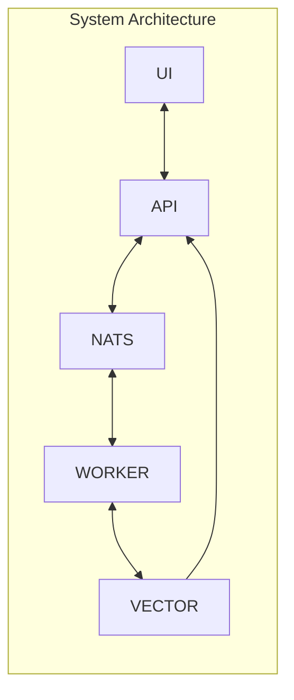

# RAG 101 Project

This project is intended to be a starting point for people creating a RAG (**R**etrieval **A**ugmented **G**eneration) system. Its main goal is to create a system to answer questions about illnesses based on documents from [Protocolos Clínicos e Diretrizes Terapêuticas - PCDT](https://www.gov.br/saude/pt-br/assuntos/pcdt).

The idea is to start with a clear vector database and allow adding PDF documents from URLs of PCDT. As these documents are added to the knowledge base, users can use the provided chat to ask questions that the software will answer.

Main components of this software are:
* **Vector Database**: we use [Milvus](https://milvus.io/) open source as a vector database.
* **Message Queue/Stream/Key Value DB**: to serve as a queue provider, a Stream infrastructure and a Key Value in-memory database we use [NATS](https://docs.nats.io/) software
* **Workers**: software written in python to execute background tasks such as: download files, extract chunks, create embeddings, compose answers, etc.
* **API**: a FastAPI software to allow the UI component to interact with backend infrastructure
* **UI**: a [Streamlit](https://streamlit.io/) software for users to interact with the platform. Its main functionalities are:
    * Allows users to ask questions to the system and get answers from it
    * Allows users to send a URL to be indexed in the RAG system
    * See some statistics from the system

**System Architecture**


## Technologies

## Developer Guide

This section provides technical details for developers working with the project:

### Milvus Vector Database
- Default port: 19530
- Schema requirements:
  - Collection must have a vector field (float32 array)
  - Recommended dimension: 768 (for most embedding models)
- Indexing options: IVF_FLAT, HNSW, or IVFSQ8 for production
- Use pymilvus to interact with Milvus Vector Database  in python

### NATS Configuration
- Default port: 4222
- Subjects used:
  - `documents.download` - for URL processing requests
  - `embeddings.create` - for chunk embedding tasks
  - `answers.generate` - for answer generation requests
- JetStream enabled for persistence
- Use nats-py to interact with nats server (JetStream, KV - KeyValue, etc.)

### Worker Services
- Implemented as Python async services
- Environment variables required:
  - `MILVUS_HOST`, `MILVUS_PORT`
  - `NATS_URL`
  - `EMBEDDING_MODEL` (default: all-MiniLM-L6-v2)
- Health check endpoint: `/health` (port 8000)
- Multiprocessing app that runs worker jobs where each on process one NATS topics. Each work can be configure the number of instances to run inside the main app. 

### FastAPI Endpoints
- Base URL: `/api/v1`
- Key endpoints:
  - `POST /questions` - Submit new question
  - `POST /documents` - Submit new document URL
  - `GET /stats` - System statistics
- OpenAPI docs available at `/docs`

### Streamlit UI
- Runs on port 8501 by default
- Environment variables:
  - `API_BASE_URL` - Points to FastAPI service
  - `UI_THEME` - Light/dark mode preference

## Project Structure
```bash
/
|- Worker
|   |- runners
|   |   |- download-file.py
|   |   |- extract-chunks.py
|   |   |- embeddings.py
|   |   |- answer-question.py
|   |- tools
|   |   |- some-usefull-tool.py
|   |   |- another-usefull-tool.py
|   |- Dockerfile
|   |- main.py
|   |- pyproject.toml
|- api
|   |- Dockerfile
|   |- controllers
|   |   |- session.py
|   |   |- documments.py
|   |   |- question-answer.py
|   |   |- stats.py
|   |- tools
|   |   |- websocket_manager.py
|   |- main.py
|   |- pyproject.toml
|- ui
|   |- tools
|   |   |- api-client.py
|   |- Dockerfile
|   |- main.py
|   |- pyproject.toml
```
