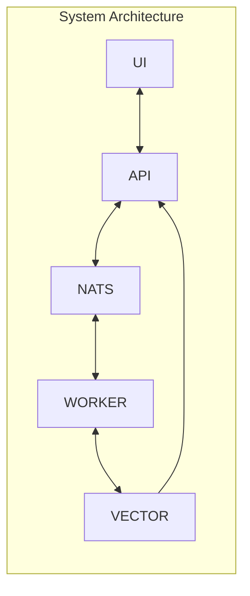

# RAG 101 Project

This project is intended to be a starting point for people creating a RAG (**R**etrieval **A**ugmented **G**eneration) system. Its main goal is to create a system to answer questions about illnesses based on documents from [Protocolos Clínicos e Diretrizes Terapêuticas - PCDT](https://www.gov.br/saude/pt-br/assuntos/pcdt).

The idea is to start with a clear vector database and allow adding PDF documents from URLs of PCDT. As these documents are added to the knowledge base, users can use the provided chat to ask questions that the software will answer.

Main components of this software are:
* **Vector Database**: we use [Milvus](https://milvus.io/) open source as a vector database.
* **Message Queue/Stream/Key Value DB**: to serve as a queue provider, a Stream infrastructure and a Key Value in-memory database we use [NATS](https://docs.nats.io/) software
* **Workers**: software written in python to execute background tasks such as: download files, extract chunks, create embeddings, compose answers, etc.
* **API**: a FastAPI software to allow the UI component to interact with backend infrastructure
* **UI**: a [Streamlit](https://streamlit.io/) software for users to interact with the platform. Its main functionalities are:
    * Allows users to ask questions to the system and get answers from it
    * Allows users to send a URL to be indexed in the RAG system
    * See some statistics from the system

**System Architecture**


## Technologies

This project leverages the following core technologies:

### Core Stack
- **Python 3.12+**: Primary programming language for all services
- **Poetry**: Dependency management and virtual environment handling for development
- **Docker & Docker Compose**: Containerization and orchestration for deployment

### Data & Messaging Infrastructure  
- **Milvus**: Open-source vector database for embeddings storage and similarity search
- **NATS**: Message broker providing queuing, streaming, and key-value storage capabilities
- **MinIO**: S3-compatible object storage (used by Milvus)
- **etcd**: Distributed key-value store (used by Milvus for metadata)

### Application Framework
- **FastAPI**: Modern Python web framework for building the REST API
- **Streamlit**: Interactive web application framework for the user interface
- **Sentence Transformers**: Library for creating embeddings from text
- **PyMilvus**: Official Python SDK for Milvus interactions
- **NATS.py**: Official Python client for NATS messaging

### Development vs Production
- **Development**: Poetry manages dependencies, virtual environments, and local execution
- **Production**: Docker containers built from Poetry-managed projects, orchestrated via Docker Compose

## Getting Started

### Prerequisites
- **Python 3.11+**: Required for all services
- **Poetry**: Install via `curl -sSL https://install.python-poetry.org | python3 -`
- **Docker & Docker Compose**: Required for running the infrastructure stack

### Quick Setup

1. **Clone and Setup Infrastructure**
   ```bash
   git clone <repository-url>
   cd rag-101
   
   # Start infrastructure services (Milvus, NATS, etc.)
   docker-compose up -d
   ```

2. **Development Setup (Choose One Service)**
   ```bash
   # Example: Setting up the worker service
   cd services/worker
   poetry install
   poetry shell
   
   # Configure environment variables
   export MILVUS_HOST=localhost
   export MILVUS_PORT=19530
   export NATS_URL=nats://localhost:4222
   
   # Run the service
   poetry run python main.py
   ```

3. **Full Production Deployment**
   ```bash
   # Build and run all services
   docker-compose -f docker-compose.yml -f docker-compose.services.yml up --build
   ```

### Development Workflow Options

**Option 1: Mixed Development**
- Run infrastructure with Docker Compose (`docker-compose up -d`)
- Run services locally with Poetry for faster development cycles

**Option 2: Full Docker**
- Run everything in containers for production-like environment
- Slower development cycle but matches production exactly

**Option 3: Service-by-Service**
- Run only the infrastructure and services you're not working on in Docker
- Run your target service locally with Poetry

### Environment Configuration
Create `.env` files for each service:
```bash
# services/worker/.env
MILVUS_HOST=localhost
MILVUS_PORT=19530
NATS_URL=nats://localhost:4222
EMBEDDING_MODEL=all-MiniLM-L6-v2

# services/api/.env
MILVUS_HOST=localhost
MILVUS_PORT=19530
NATS_URL=nats://localhost:4222

# services/ui/.env
API_BASE_URL=http://localhost:8000/api/v1
UI_THEME=light
```

## Developer Guide

This section provides technical details for developers working with the project:

### Milvus Vector Database
- Default port: 19530
- Schema requirements:
  - Collection must have a vector field (float32 array)
  - Recommended dimension: 768 (for most embedding models)
- Indexing options: IVF_FLAT, HNSW, or IVFSQ8 for production
- Use pymilvus to interact with Milvus Vector Database  in python

### NATS Configuration
- Default port: 4222
- Subjects used:
  - `documents.download` - for URL processing requests
  - `embeddings.create` - for chunk embedding tasks
  - `answers.generate` - for answer generation requests
- JetStream enabled for persistence
- Use nats-py to interact with nats server (JetStream, KV - KeyValue, etc.)

### Worker Services
- Implemented as Python async services using Poetry for dependency management
- Environment variables required:
  - `MILVUS_HOST`, `MILVUS_PORT`
  - `NATS_URL`
  - `EMBEDDING_MODEL` (default: all-MiniLM-L6-v2)
- Health check endpoint: `/health` (port 8000)
- Multiprocessing app that runs worker jobs where each process handles one NATS topic. Each worker can be configured with the number of instances to run inside the main app.
- **Development**: `poetry run python main.py` or `poetry shell` then `python main.py`
- **Production**: Dockerized with Poetry-managed dependencies 

### FastAPI Endpoints
- Base URL: `/api/v1`
- Key endpoints:
  - `POST /questions` - Submit new question
  - `POST /documents` - Submit new document URL
  - `GET /stats` - System statistics
- OpenAPI docs available at `/docs`
- **Development**: `poetry run uvicorn main:app --reload` or use Poetry scripts
- **Production**: Dockerized FastAPI service with Poetry-managed dependencies

### Streamlit UI
- Runs on port 8501 by default
- Environment variables:
  - `API_BASE_URL` - Points to FastAPI service
  - `UI_THEME` - Light/dark mode preference
- **Development**: `poetry run streamlit run main.py` or use Poetry scripts
- **Production**: Dockerized Streamlit service with Poetry-managed dependencies

## Development Workflow

The project uses a **Poetry + Docker** approach that provides flexibility for both development and deployment:

### Local Development with Poetry
```bash
# Navigate to a service directory
cd services/worker/

# Install dependencies and create virtual environment
poetry install

# Activate the virtual environment
poetry shell

# Run the service locally
poetry run python main.py

# Add new dependencies
poetry add <package-name>
poetry add --group dev <dev-package-name>
```

### Key Poetry Commands
- `poetry install`: Install all dependencies from `pyproject.toml`
- `poetry add`: Add new dependencies
- `poetry remove`: Remove dependencies
- `poetry shell`: Activate virtual environment
- `poetry run`: Execute commands within virtual environment
- `poetry export`: Generate requirements.txt for Docker builds

### Development Dependencies Structure
Each service's `pyproject.toml` includes:
- **Production dependencies**: Core packages needed to run the service
- **Development dependencies**: Testing, linting, formatting tools (pytest, black, mypy, etc.)

### Docker Integration
```bash
# Each service Dockerfile uses Poetry for dependency management
FROM python:3.11-slim
WORKDIR /app
COPY pyproject.toml poetry.lock ./
RUN pip install poetry && poetry config virtualenvs.create false
RUN poetry install --only=main
COPY . .
CMD ["poetry", "run", "python", "main.py"]
```

### Why This Approach?
- **Development**: Poetry provides excellent dependency management, virtual environments, and reproducible builds
- **Production**: Docker ensures consistent deployment across environments
- **Integration**: Poetry's export feature bridges development and deployment workflows
- **Team Consistency**: Everyone uses the same dependency versions and development environment

## Project Structure

This structure balances comprehensiveness with simplicity, making it easy for newcomers while maintaining clear separation of concerns:

```bash
/
├── services/
│   ├── worker/
│   │   ├── main.py                    # Worker application entry point
│   │   ├── handlers/                  # Background task handlers
│   │   │   ├── __init__.py
│   │   │   ├── documents.py           # Download & extract chunks
│   │   │   ├── embeddings.py          # Create embeddings
│   │   │   └── answers.py             # Generate answers
│   │   ├── Dockerfile
│   │   └── pyproject.toml
│   ├── api/
│   │   ├── main.py                    # FastAPI application entry point
│   │   ├── routers/                   # API route handlers
│   │   │   ├── __init__.py
│   │   │   ├── documents.py           # Document management endpoints
│   │   │   ├── questions.py           # Question answering endpoints
│   │   │   ├── sessions.py            # Session management
│   │   │   └── stats.py               # System statistics
│   │   ├── Dockerfile
│   │   └── pyproject.toml
│   └── ui/
│       ├── main.py                    # Streamlit application entry point
│       ├── components/                # UI components
│       │   ├── __init__.py
│       │   ├── chat.py               # Chat interface
│       │   ├── document_upload.py    # Document upload form
│       │   └── stats_dashboard.py    # Statistics dashboard
│       ├── Dockerfile
│       └── pyproject.toml
├── shared/                            # Common utilities across services
│   ├── __init__.py
│   ├── database.py                    # Milvus connection & operations
│   ├── messaging.py                   # NATS client & operations
│   ├── models.py                      # Shared data models
│   └── config.py                      # Configuration management
├── docker-compose.yml                 # Infrastructure setup
├── docs/                              # Documentation
└── volumes/                           # Docker volumes (ignored in git)
```

**Key Improvements:**
- **Consistent naming**: All directories use lowercase with hyphens/underscores consistently
- **Shared utilities**: Common code in `shared/` prevents duplication
- **Clear organization**: `handlers/`, `routers/`, and `components/` are self-explanatory
- **Scalable structure**: Easy to add new handlers, routes, or components as the project grows
- **Standard Python**: Follows Python packaging conventions with `__init__.py` files

**Poetry + Docker Integration:**
- Each service directory contains both `pyproject.toml` (Poetry) and `Dockerfile`
- `pyproject.toml` defines dependencies, scripts, and development tools
- `poetry.lock` ensures reproducible dependency resolution across environments
- Dockerfiles use Poetry for dependency installation in production containers
- `shared/` directory dependencies are managed via local path dependencies in Poetry
- Development uses Poetry virtual environments; production uses Docker containers
